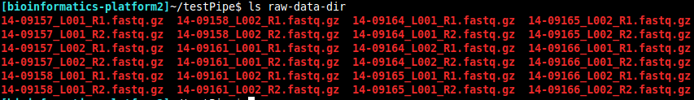
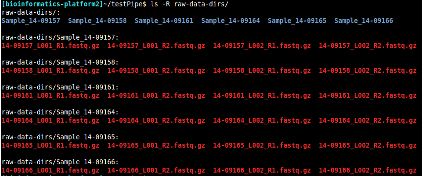
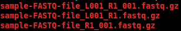

# `RNAsik-pipe` easy and quick RNA-seq(uencing) pipeline

> RNAsik-pipe is written in pure [BigDataScrip](http://pcingola.github.io/BigDataScript/) (BDS) language
> There are many advantages in using BDS, but the main ones are:
>  1. One script works on your local machine, on your remote server and on you cluster
>  2. Checkpoints - never need to run your job from the start in case it stopped. Start from where you left off
>  3. Remote access to your data. Do need to worry about `scp`ing you data to your server, just point RNAsik-pipe
> to your cloude store if you like
> As for RNAsik-pipe itself it just makes your life easy. One script solves many problems. Simply give your
> raw data to RNAsik-pipe and provide with the reference files and press go ! [Enter]

## Content

- [Introduction](#introduction)
  - [Get your FASTQ files](#get-your-fastq-files)
  - [Get RNAseq metrics](#get-rnaseq-metrics)
  - [get your counts](#get-your-counts)
- [Installation](#installation)
- [Prerequisites](#prerequisites)
- [Quick start](#quick-start)
- [Documentation](#documentation)
  - [RNAsik-pipe directory hierarchy](#rnasik-pipe-directory-hierarchy)
  - [Additional and optional files](#additional-and-optional-files)
  - [Best practice tip](#best-practice-tip)
  - [Options](#options)

## Introduction

### Get your FASTQ files

  Your raw data will always come in FASTQ format. The number of FASTQ files will depend on many things
  including:

  - Number of samples 
  - Number of replicates 
  - Your sample was split into different lanes
  - Your are sequencing paired-end data

  Your FASTQ files might reside in one directory e.g directory per experiment

  

  In this example sample 14-09157, which might WT is split across two lanes `L001` and `L002`, which is 
  typical of Illumina sequencing. That is two files, one for each lane. We can also see that this is
  paire end data. That means for each file there has to be a pair file, that is R1 and R2. In summary
  single sample, e.g WT is covered by four FASTQ files:
     - 14-09157_L001_R1.fastq.gz
     - 14-09157_L001_R2.fastq.gz
                 AND 
     - 14-09157_L002_R1.fastq.gz
     - 14-09157_L002_R2.fastq.gz
  you can use `cat` command to concatenate files across different lanes
  e.g `cat 14-09157_L001_R1.fastq.gz 14-09157_L002_R1.fastq.gz > 14-09157_merged.fastq.gz` or you can merge
  BAM files with `samtools` later. `STAR` aligner can merger on the fly and what RNAsik-pipe is using.

  OR 

  Each sample might be put into its own subdirectory e.g

  
  
  In this example each sample is placed into its own directory. Now we can see directory `Sample_14-09157`, 
  which will hold four files for described above.

  `RNAsik-pipe` can work with either of those two options. Specify your "root" directory either with `-fqDir`
  or `-fqDirs` options.

### Get RNAseq metrics

  [RNA-SeQC](https://www.broadinstitute.org/cancer/cga/rna-seqc) requires you BAM to be sorted,
  reordered and have duplicates marked. Here is detailed [instructions](supplementary/RNAseQC-manual.pdf)
  for how to prepare your BAMs files for RNAseQC, BUT the good news is you don't even need to worry about this!
  `RNAsik-pipe` takes care of long and laborious BAM file manipulation for RNA-SeQC tools, just flag 
  `-prePro` to get your BAMS in the right shape and `-RNAseQC` to get the actual report

### Get your read counts

  Do you want to do differential gene expression analysis..? just flag `-count` and you will get your counts

## Prerequisites

- [BigDataScript](http://pcingola.github.io/BigDataScript/download.html)
- [STAR aligner](https://github.com/alexdobin/STAR/releases)
- [Picard tools](http://broadinstitute.github.io/picard/)
- [RNA-SeQC](https://www.broadinstitute.org/cancer/cga/rna-seqc)
- [featureCounts](http://subread.sourceforge.net/)

## Installation

Make sure to install [BigDataScript](http://pcingola.github.io/BigDataScript/) first. Follow [BDS installation instructions](http://pcingola.github.io/BigDataScript/download.html)

**Recomended** 

Get [latest stable release](https://github.com/MonashBioinformaticsPlatform/RNAsik-pipe/releases) by 
downloading `*tar.gz` file.

1. Locate your `*tar.gz` file
2. `tar zxvf *tar.gz file` 
3. You `RNAsik-pipe` executable file is located in `src` directory
 
**If you like to get developing version**

`git clone https://github.com/MonashBioinformaticsPlatform/RNAsik-pipe.git`

## Quick start

- If you have a `module` system on you server/cluster make sure to `module load` all required tools e.g `module load STAR`

- run `RNAsik-pipe` by pointing to the executable file. e.g if you downloaded `*tar.gz` file into `Downlaods`
directory and unpacked there, then run `RNAsik-pipe` from anywhere as such `~/Downloads/RNAsik-pipe/src/RNAsik-pipe`

- To align `RNAsik-pipe -star -fqRegex A -genomeIndex path/to/yourIndexDirectory` 
- To get counts `RNAsik-pipe -count -gtfFile path/to/yourGTFfile`
- To get RNA-SeQC report `RNAsik-pipe -prePro -fastaRef path/to/yourFASTAreference-file -RNAseQC`

**You can simply specify all of the options at the start and let `RNAsik-pipe` to do everything for your**

- `RNAsik-pipe` will guide you through. `RNAsik-pipe` will let you know if you have forgotten any files needed for your run. 

## Documentation

RNAsik-pipe has several "sanity checks" inbuilt so that users almost always can't go wrong in using it.
There are three main parts to the pipeline:

    1. Reads aligning using [STAR aligner](https://github.com/alexdobin/STAR/releases) - get BAMs
    2. Reads counting using [featureCounts](http://subread.sourceforge.net/) - get conts
    3. Getting RNAseq metrics report using [RNA-SeQC](https://www.broadinstitute.org/cancer/cga/rna-seqc). In order to run [RNA-SeQC](https://www.broadinstitute.org/cancer/cga/rna-seqc) your BAM files need to be preprocessed in particular way. `RNAsik-pipe` takes care of all that. In order to run [RNA-SeQC](https://www.broadinstitute.org/cancer/cga/rna-seqc) through `RNAsik-pipe` you need to also flag `-prePro` to get your BAMs in the right shape for [RNA-SeQC](https://www.broadinstitute.org/cancer/cga/rna-seqc).

You can do each part separatelly and jsut get BAMs and/or just get counts and/or just pre-process your BAM files and/or just run [RNA-SeQC](https://www.broadinstitute.org/cancer/cga/rna-seqc). However `RNAsik-pipe` does assume particular working directory hierarchy. 

### RNAsik-pipe directory  hierarchy

   - `bamFiles/` this directory will be created if running `RNAsik-pipe` with `-star` flag. This directory holds _unsorted_ BAM files, an output from [STAR aligner](https://github.com/alexdobin/STAR/releases). 

**If would like to mimic `bamFiles/` directory and BAM files please NOTE downstream workflow of `RNAsik-pipe1assumes `STAR` like BAM files, that is each BAM file ends with `\_Aligned.out.bam`**

   - `refFile/` this directory will only be created if running `RNAsik-pipe` with `-makeIndices` flag. This directory holds all required indices files including reference genome file and one subdirectory `*-starIndex`, which is your specific genome index for [STAR aligner](https://github.com/alexdobin/STAR/releases). 

**You can reuse that `\*-starIndex` directory for other runs provided that you are aligning against the same
reference genome**

   - `featureNo/` and `featureReverse/` these two directories will only be created if running `RNAsik-pipe` with `-count` flag. Those directories holds read counts files, one read count file per each BAM file. `RNAsik-pipe` automatically does both:
       - No = read aligned to either forward or reverse strand of the reference
       - Reverse = read alined to reverse strand of the reference only

**Downstream workflow of `RNAsik-pipe` will swap `\_Aligned.out.bam` for `.txt`. It will keep the root name for all files in `featureNo/` and `featureReverse/` directories**

   - `preqcBamFiles/` directory with pre-processed BAM files. Files are pre-processed using [Picard tools](http://broadinstitute.github.io/picard/)

   - `RNAseQC-report/` this direcotry is set as an output directory for `rna-seqc` run. All of your metrics information held in it. You can simply open that directory in the web browser to see your RNAseq metrics report.

### Additional and optional files 

    - `RNAseQC-SampleIds.txt` when you run `RNAsik-pipe` with flag `-RNAseQC` this file is automatically created in your root - project directory. This is an essential file for `rna-seqc` tools. It specify all of your sample names and path those files, which must start with `preqcBamFiles/` prefix. 

    - `*.html` [BDS](http://pcingola.github.io/BigDataScript/) automatically creates HTML report for your run. You can see all setps and more about your `RNAsik-pipe` run by looking at that report.

### Best practice tip

   - Make new directory for your RNAseq analysis e.g koVSwt-MouseLiver
   - `cd koVSwt-MouseLiver` 
   - Run your `RNAsik-pipe` from within this "root" directory

### Options

   - `-makeIndices` use this flag to make all required indices files for complete `RNAsisk-pipe` run. There are two index files that are required to be in the same directory as the reference genome file and one index directory for [STAR aligner](https://github.com/alexdobin/STAR/releases).

   - `-star` use this flag to initiate [STAR](https://github.com/alexdobin/STAR/releases) run. This is a boolflag and therefore it doesn't require any arguments.

   - `-fqDir` and `-fqDirs` have been explained above in [Get your FASTQ files](#get-your-fastq-files) section. **Only use one of two options !**

   - `-fqRegex` specify one of the three possible options (A,B or C) that are inbuilt in `RNAsik-pipe`

   

      - `-fqRegex A` targets files alike `sample-FASTQ-file_L001_R1_001.fastq.gz` 
      - `-fqRegex B` targets files alike `sample-FASTQ-file_L001_R1.fastq.gz` 
      - `-fqRegex C` targets files alike `sample-FASTQ-file_R1_001.fastq.gz` 

Use can also provide anyother possible unique options using [regex](https://en.wikipedia.org/wiki/Regular_expression), make sure to use `$` at the end of your [regex](https://en.wikipedia.org/wiki/Regular_expression) to indicate the direction i.e from the right to the left of the string. 

## Caveats 

- At the moment `STAR aligner` has fixed options, here is the default:

```BASH
STAR --runThreadN 26 \
     --genomeDir $genomeIndex \
     --outSAMtype BAM Unsorted \
     --outSAMattrRGline ID:001 CN:AGRF DS:RNA-seq PL:ILLUMINA PM:MiSeq SM:$uniqueName \
     --outSAMunmapped Within \
     --readFilesCommand zcat \
     --readFilesIn $read1 $read2 \
     --outFileNamePrefix $preFix
```

- Right now only `featureCounts` is supported for read counting
- At the moment there isn't an option to choose the strand direction for read counts. `RNAsik-pipe` simply
counts using both stranded NO and stranded REVERSE options
