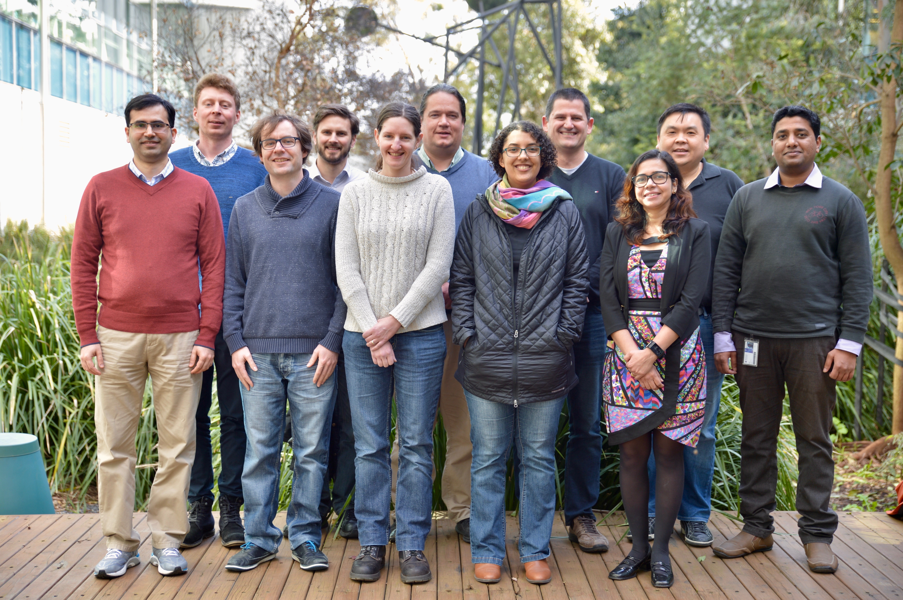

# [RNAsik pipeline docs](http://github.com/monashbioinformaticsplatform/RNAsik-pipe.git)

## Quick start

### Align raw reads

```BASH
RNAsik -align star \
       -fastaRef /path/to/reference.fasta \
       -fqDir /path/to/raw-data/directory
```

### Count gene features

```BASH
RNAsik -counts \
       -gtfFile path/to/annotation.gtf
```
### The lot

```BASH
RNAsik -fqDir /path/to/raw-data/directory \
       -align star \
       -refFiles /path/to/refDir \
       -counts \
       -metrics \
       -threads 10
```

### Try it out

```BASH
RNAsik -align star \
       -fastaRef http://bioinformatics.erc.monash.edu/home/kirill/ref-files/Mus_musculus/Mus_musculus.GRCm38.dna_sm.primary_assembly.fa.gz \
       -fqDir http://bioinformatics.erc.monash.edu/home/kirill/RNAsikSampleData/rawData/Dicer-fl.fl-iCre75-RNAseq.tar \
       -counts \
       -gtfFile http://bioinformatics.erc.monash.edu/home/kirill/ref-files/Mus_musculus/Mus_musculus.GRCm38.84.gtf.gz \
       -metrics \
       -threads 10
```

This publicly available data from [NCBI](https://www.ncbi.nlm.nih.gov/geo/query/acc.cgi?acc=GSE69937). 

## Introduction

`RNAsik` does alignment AND read counting, which makes [Degust](degust.erc.monash.edu) analysis one upload away AND BAM file pre-processed for IGV AND diagnostic QC metrics. `RNAsik` wraps [these tools](#prerequisites) making your RNAseq analysis more streamline. `RNAsik` has also "sanity checks" inbuilt, checking command line options, checking if options are valid files/directories and it will talk to you so don't sweat :) but do read the error messages.

## Prerequisites

- [BigDataScript](http://pcingola.github.io/BigDataScript/download.html)
- [STAR aligner](https://github.com/alexdobin/STAR/releases)
- [subread](http://subread.sourceforge.net/)
- [samtools](http://www.htslib.org/download/)
- [bedtools2](http://bedtools.readthedocs.io/en/latest/index.html)
- [Picard tools](http://broadinstitute.github.io/picard/)
- [QualiMap](http://qualimap.bioinfo.cipf.es/)
- [MultiQC](http://multiqc.info/) 
- [FastQC](http://www.bioinformatics.babraham.ac.uk/projects/fastqc/)

## Installation

Follow [ansible installation guid](http://docs.ansible.com/ansible/intro_installation.html) to get ansible then:

```BASH
git clone https://github.com/MonashBioinformaticsPlatform/bio-ansible
cd bio-ansible/
ansible-playbook -i host bio.yml --tags bds,rnasik,star,subread,samtools,htslib,bedtools,picard,qualimap,fastqc,multiqc
```
[Need more help?](https://github.com/MonashBioinformaticsPlatform/bio-ansible)

## User input

### Reference files

<table>
<tr><th class="left_col">Input File</th><th>Description</th></tr>
<tr><td class="left_col">FASTA file</td><td>Most often this is your genomic reference sequence. It is a FASTA file holding raw DNA sequences where different features e.g chromosomes are labeled uniquely with a header line starting with '>'. [FASTA Format Description](https://en.wikipedia.org/wiki/FASTA_format) </td></tr>
<tr><td class="left_col">GTF/GFF/SAF file</td><td> This is your gene annotation file (i.e coordinates of your genes, exons and other genomic features). This should be linked and associated with your genomic reference file. SAF (simple annotation format) is something that featureCounts use and it supported by the pipeline</td></tr>
</table>

> It is highly recommended that both of those files come from the same distributor. Most common distributors are [Ensembl](http://www.ensembl.org/index.html), [UCSC](http://genome.ucsc.edu/) and [NCBI](ftp://ftp.ncbi.nih.gov/genomes/).

### Raw data

<table>
<tr><th>Input File</th><th>Description</th></tr>
<tr><td class="left_col">FASTQ file</td><td>These are your raw files that are provided by the sequencing facility to you, they can be gzipped (.fq, .fastq, .fq.gz, .fastq.gz) </td></tr>
</table>

> `RNAsik` can handle nested directories as long as your data is homogeneous i.e all data belongs to the same library type e.g paired-end(if paired end, RNASik looks for 'R1' and 'R2' in the filenames to distinguish read pairs. 

## RNASik Output files and directories

### Description of output directories

<table>
<tr><th>Directories</th><th>Description</th></tr>
<tr><td class="left_col">refFiles/</td><td> Contains the reference files (FASTA and GTF) and indices (aligner index) used in the analysis run </td></tr>
<tr><td class="left_col">bamFiles/</td><td> Contains "raw" BAM files, outputed from an aligner. Also may hold additional files from alignment run e.g aligner specific log files </td></tr>
<tr><td class="left_col">countFiles/</td><td> Contains read count files, "raw" - from `featureCounts`, degust ready counts and filtered for protein_coding features only</td></tr>
<tr><td class="left_col">markedBams/</td><td> Contains pre-processed BAM files, these BAMs are sorted, reordered and duplicates marked as well as indexed, all using picard tools. These BAMs can be used in [IGV](http://software.broadinstitute.org/software/igv/) to view read alignments </td></tr>
<tr><td class="left_col">fastqReport/</td><td> Contains FastQC HTML reports for individual FASTQ files</td></tr>
<tr><td class="left_col">qualiMapResults/</td><td> Contains int(ra|er)genic rates from each BAM file. Each BAM has its own directory with metric files. These results generated using `QualiMap rnaseq` command</td></tr>
<tr><td class="left_col">fastqDir/</td><td> If you are going to pull your FASTQ file over http in tarball, then tarball will be unarchived here</td></tr>
<tr><td class="left_col">multiqc_data/</td><td>Directory created by MultiQC holding a parsed text file, it doesn't serve any purpose for html file</td></tr>
<tr><td class="left_col">logs</td><td>Directory that holds subdirectories, self explanatory, with logs files</td></tr>
</table>

### Description of output files

<table>
<tr><th>Files</th><th>Description</th></tr>
<tr><td class="left_col">geneIds.txt</td><td> Three additonal columns for read counts. Gene Id, Gene Name, Gene Biotype. Count files with "-withNames" postfix have those columns included </td></tr>
<tr><td class="left_col">strandInfo.txt</td><td> Contains guesses, based on `featureCounts` `.summary` files, strand informataion</td></tr>
<tr><td class="left_col">multiqc_report.html</td><td>This is the report file produced by MultiQC tool. A stand alone html file and can be viewed in any browser</td></tr>
</table>

## Command line options

### Read alignment

<table>
<tr><th>Options</th><th>Usage</th></tr>
<tr><td class="left_col">-align</td><td>specify your aligner of choice [star|starWithAnn|hisat|bwa]</td></tr>
<tr><td class="left_col">-fqDir</td><td>specify path to your raw data directory. `RNAsik` will search that path recursively, so don't worry about nested directores</td></tr>
<tr><td class="left_col">-fastaRef</td><td>specify path to your reference FASTA file, i.e file that holds your refrence genome</td></tr>
<tr><td class="left_col">-paired</td><td>specify if data is paired end (RNASik looks for R1 and R2 in the FASTQ filename representing Read 1 and Read 2 </td></tr>
</table>

### Read counting

<table>
<tr><th>Options</th><th> Usage </th></tr>
<tr><td class="left_col">-counts</td> <td> flag if you'd like to get read counts</td></tr>
<tr><td class="left_col">-gtfFile</td> <td> specify path to your reference annotation file [GTF|GFF|SAF]</td></tr>
</table>

### Reads metrics

<table>
<tr><th>Options</th><th> Usage </th></tr>
<tr><td class="left_col">-metrics</td> <td> This is an aggregate flag that is a short hand of writing out -prePro, -fastqc, -exonicRate and -multiqc</td></tr>
<tr><td class="left_col">-fastqc</td> <td> flag if you'd like to get FastQC reports for your fastq files</td></tr>
<tr><td class="left_col">-exonicRate</td> <td> flag if you'd like to get Int(ra|er)genic rates for your reads, using QualiMap tool</td></tr>
<tr><td class="left_col">-multiqc</td> <td> flag if you'd like to get general report that summarises different log files including `STAR`, `featureCounts`, `FastQC` and `QualiMap`</td></tr>
</table>

### Extra options

<table>
<tr><th>Options</th><th> Usage </th></tr>
<tr><td class="left_col">-prePro</td> <td> flag to get your BAM files pre-processed i.e get them sorted, duplicates marked and index</td></tr>
<tr><td class="left_col">-samplesSheet</td> <td> specify name of a tab separated text file, two columns,the first with old prefixes to be removed by new prefixes in the second column</td></tr>
<tr><td class="left_col">-genomeIdx</td> <td> specify path to pre-existing alignment index </td></tr>
<tr><td class="left_col">-outDir</td><td>give a name to your analysis output directory [sikRun] </td></tr>
<tr><td class="left_col">-extn</td> <td> provide your fastq files extntion. [".fastq.gz"]  </td></tr>
<tr><td class="left_col">-pairIds</td> <td> provide type identification, default is [`_R1,_R2`]</td></tr>
<tr><td class="left_col">-threads</td> <td> provide number of threads to use. [4]  </td></tr>
<tr><td class="left_col">-memory</td> <td> provide amount of memory to use. [40000000000]  </td></tr>
<tr><td class="left_col">-extraOpts</td> <td> provide key=value pairs, one per line, with key being tool name and value is a string of options e.g `star="--outWigType bedGraph"` </td></tr>
<tr><td class="left_col">-configFile</td><td>specify your own config file with key=value pairs, one per line, for all tools</td></tr>
</table>

### Unusual user case

<table>
<tr><td class="left_col">-bamsDir</td> <td> specify path to BAMs directory. Use if bams were generated outside of the pipeline </td></tr>
</table>



<footer> <p><a href="http://github.com/serine">Created by Kirill Tsyganov with support from Monash Bioinformatics Platform</a></p> </footer>
<p><a href="https://twitter.com/intent/tweet?screen_name=kizza_a" class="twitter-mention-button" data-size="large" data-show-count="false">Tweet to @kizza_a</a><script async src="//platform.twitter.com/widgets.js" charset="utf-8"></script> </p>

<p class="twitter-btn">
<a class="twitter-share-button"
  href="https://twitter.com/intent/tweet?text=Hey%20I%27m%20using%20this%20fully%20sick%20RNAseq%20pipeline%20It%27s%20sik%20easy%20http%3A%2F%2Fgithub%2Ecom%2Fmonashbioinformaticsplatform%2FRNAsik%2Dpipe%20by%20%40kizza%5Fa%20from%20%40MonashBioinfo" data-size="large">
Share</a>
</p>
